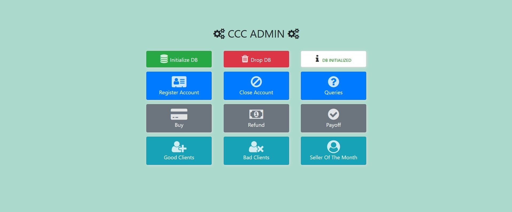
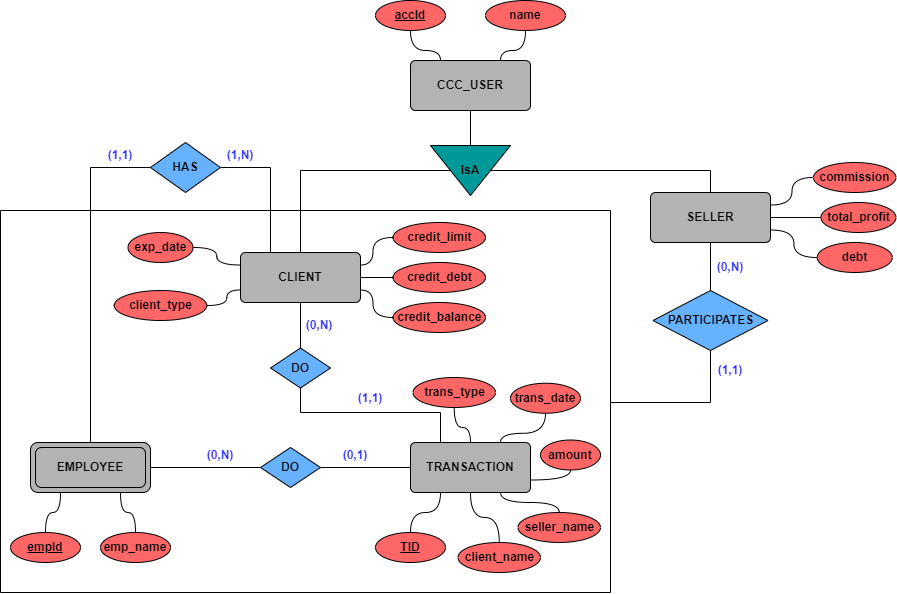

# Credit-Card-Company

## About

This project was developed for a university course and involves creating a web application simulating Client-Seller payments and providing useful statistics. Core of this project is the design of a relational model using **MySQL** database to store and maintain all the transactions.

## Database ER Model

## Setup

- **XAMPP**

## Run

- Copy the `ccc/` folder into `{PATH_TO_XAMPP_FOLDER}/htdocs/`
- Navigate: `localhost/ccc/index.php`

### Routes/Pages

- `index.php` -> main page
- `account.php` -> register / close account
- `transactions.php` -> buy / refund transactions, payoff procedure
- `queries.php` -> status reports for transactions
- `info.php` -> state of good clients / bad clients / seller of the month
